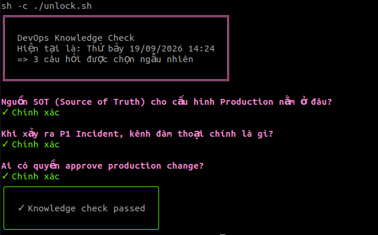
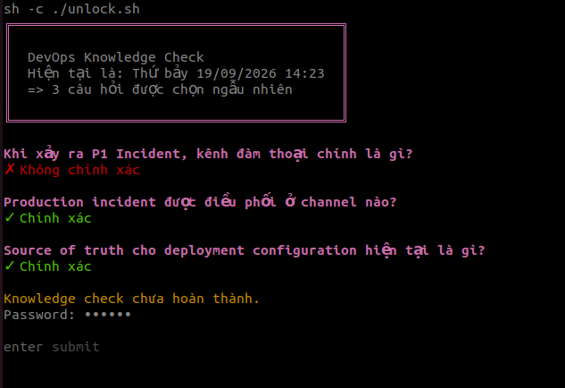
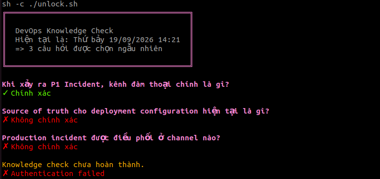

# Đăng nhập bằng câu hỏi nội bộ
> Biến rào cản bảo mật thành văn hóa chia sẻ kiến thức trong đội ngũ Engineering

#### Hình ảnh minh họa hệ thống
* Trường hợp thành công
<table>
  <tr>
    <td>
      
    </td>
    <td>
      
    </td>
  </tr>
</table>

* Trường hợp dùng failback: `password`
<table>
  <tr>
    <td>
      
    </td>
    <td>
      
    </td>
  </tr>
</table>

* Trường hợp thất bại
<table>
  <tr>
    <td>
      
    </td>
    <td>
      
    </td>
  </tr>
</table>


**Tư duy thiết kế**
* > *Security không nhất thiết phải làm mọi thứ khó hơn*

Thay vào đó:
* **Làm cho việc làm đúng trở nên dễ hơn,** và **việc làm sai/bypass trở nên khó hơn**

Cụ thể:
* Thay vì chỉ hỏi 
    > Bạn có bí mật gì? (Password/MFA)
* Hệ thống hỏi 
    > Bạn có thực sự hiểu hệ thống bạn sắp thao tác không?

* Tương tự, DevOps engineer đã quen với hệ thống nên **có thể trả lời nhanh:**
    > * Service này owner là ai?
    > * Deploy đi qua đâu?
    > * Incident channel nào?

* **Người không có context vẫn có thể xác thực** bằng một phương thức mạnh hơn

Như vậy security control đồng thời **tạo ra một động lực để mọi người:**
* hiểu hệ thống mình đang vận hành
* biết quy trình của team
* cập nhật documentation / chia sẻ kiến thức
* **phát hiện những điểm chưa rõ trong quy trình**

🎯 **Giá trị Mang lại (Business & Team Impact)**
| Khía cạnh |Giá trị đạt được |
| --- | --- |
| Developer Experience (DX) | **Giảm ma sát cho thao tác hàng ngày** đối với engineer đã nắm rõ context| 
| Culture & Knowledge | Tự động hóa việc nhắc nhở quy trình, owner của service, kênh điều phối incident |
| Process Visibility | Ghi log thống kê các câu hỏi bị trả lời sai nhiều nhất $\rightarrow$ Input trực tiếp để cập nhật tài liệu | 
|  Security Risk Control | Tạo ra rào cản tức thì với các đợt quét tự động (Automated Scripts) hoặc Credential Stuffing đơn giản chưa hiểu context nội bộ | 

**Ý tưởng**
Trong một tổ chức, có những thông tin không nhất thiết phải là secret nhưng thường chỉ người đang làm việc trong team mới biết:
* Ai là owner của một service?
* Production deployment đi qua quy trình nào?
* Incident được điều phối ở đâu?
* Source of truth của configuration là gì?
* Khi deployment thất bại thì rollback như thế nào?

Những câu hỏi này không nhằm thay thế password hay MFA.
> Chúng tạo ra một knowledge check trước khi cho phép tiếp tục

* Nếu người dùng trả lời đúng, họ có thể vào shell ngay
* Nếu không trả lời được, 
    > vẫn có một authentication fallback bằng password hoặc cơ chế xác thực mạnh hơn.
```
            ┌─────────────────┐
            │   Login request │
            └────────┬────────┘
                     │
                     ▼
          ┌─────────────────────┐
          │  Internal questions │
          └──────────┬──────────┘
                     │
            ┌────────┴────────┐
            │                 │
           PASS              FAIL
            │                 │
            ▼                 ▼
        ┌────────┐      ┌─────────────┐
        │  Shell │      │  Fallback:  │
        └────────┘      │ SSO / MFA / │
                        │  Password   │
                        └──────┬──────┘
                               │
                              PASS
                               │
                               ▼
                        Interactive Shell
```
**Mục tiêu**
> Dự án hướng tới việc biến security từ một lớp kiểm soát gây friction thành một phần của văn hóa học tập trong doanh nghiệp

**Nguyên tắc:**
* Người hiểu hệ thống nên có con đường đi nhanh hơn.
* Điều này cũng tạo ra một feedback loop:
```
Knowledge check
       │
       ▼
Phát hiện khoảng trống kiến thức
       │
       ▼
Team giải thích / cập nhật documentation
       │
       ▼
Quy trình rõ ràng hơn
       │
       ▼
Knowledge check tốt hơn
```

> **Nếu một câu hỏi thường xuyên bị trả lời sai**, đó có thể là dấu hiệu rằng documentation hoặc quy trình chưa đủ rõ — không nhất thiết là vấn đề của người dùng

**Tính năng**
* Câu hỏi được chọn ngẫu nhiên
* Có thể cấu hình số lượng câu hỏi
* Có thể thay đổi số câu hỏi theo ngày trong tuần
* Có thể thay đổi số câu hỏi theo khung giờ
* Câu hỏi được tổ chức thành một question bank

> * Trả lời bằng giao diện terminal thông qua gum
> * Nếu trả lời đúng toàn bộ câu hỏi → mở shell
> * Nếu không hoàn thành → chuyển sang authentication fallback
> * Ghi log thống kê các lần xác thực.


* **Không ghi password vào log**
* Policy được tách khỏi Bash script bằng JSON.

#### Cấu trúc dự án
```
.
├── README.md
├── config.json
├── questions.json
└── unlock.sh
```

**questions.json**
> Chứa ngân hàng câu hỏi nội bộ

Ví dụ:
```json
{
  "questions": [
    {
      "id": 1,
      "topic": "deployment",
      "question": "Ai là owner chính của việc deploy production?",
      "options": [
        "DevOps",
        "Backend team",
        "Product team",
        "Security team"
      ],
      "answer": "DevOps"
    }
  ]
}
```

**Mỗi câu hỏi gồm:**
| Field | Ý nghĩa |
| --- | --- |
| id | 	ID duy nhất của câu hỏi | 
| topic | 	Chủ đề | 
| question | 	Nội dung câu hỏi | 
| options | 	Các lựa chọn | 
| answer | 	Đáp án đúng | 


**config.json**
> Chứa policy xác thực

Ví dụ:
```json
{
  "rules": [
    {
      "name": "weekday_evening",
      "days": [
        "monday",
        "tuesday",
        "wednesday",
        "thursday",
        "friday"
      ],
      "time_from": "18:00",
      "time_to": "23:59",
      "questions": 2
    },
    {
      "name": "monday_morning",
      "days": [
        "monday"
      ],
      "time_from": "06:00",
      "time_to": "11:59",
      "questions": 5
    },
    {
      "name": "weekend",
      "days": [
        "saturday",
        "sunday"
      ],
      "time_from": "06:00",
      "time_to": "23:59",
      "questions": 1
    },
    {
      "name": "default",
      "days": [
        "monday",
        "tuesday",
        "wednesday",
        "thursday",
        "friday",
        "saturday",
        "sunday"
      ],
      "time_from": "00:00",
      "time_to": "23:59",
      "questions": 3
    }
  ],

  "logging": {
    "file": "./unlock.log"
  }
}
```

**Ví dụ về rule**
```json
{
  "name": "weekday_evening",
  "days": [
    "monday",
    "tuesday",
    "wednesday",
    "thursday",
    "friday"
  ],
  "time_from": "18:00",
  "time_to": "23:59",
  "questions": 2
}
```
> Có nghĩa là:
> * Từ thứ hai đến thứ sáu, trong khoảng 18:00–23:59, **yêu cầu trả lời 2 câu hỏi**
> * Các rule được kiểm tra từ trên xuống. **Rule đầu tiên match sẽ được sử dụng**

### **Cài đặt**

Yêu cầu phầm mềm:
* bash
* jq
    > sudo apt-get install jq coreutils
* shuf
* [gum](https://github.com/charmbracelet/gum)

Phân quyền thực thi:
```bash
chmod +x unlock.sh
```

Kiểm tra:
```bash
./unlock.sh
```

Thêm vào file khởi tạo shell của user (ví dụ: ~/.bashrc hoặc ~/.zshrc):
```bash
# Add to the very end of ~/.bashrc
if [ -t 1 ]; then
    ./path/to/unlock.sh
fi 
```

**Luồng xác thực** mỗi lần chạy chương trình:
* Xác định ngày hiện tại
* Xác định thời gian hiện tại
* Tìm policy phù hợp trong *config.json*
* Xác định số lượng câu hỏi cần trả lời
* Chọn ngẫu nhiên các câu hỏi từ *questions.json*
* Hiển thị câu hỏi bằng gum.
* Kiểm tra đáp án.
    * Nếu đúng tất cả 
        > → mở shell
    * Nếu sai 
        > → chuyển sang authentication fallback
* Ghi kết quả vào log